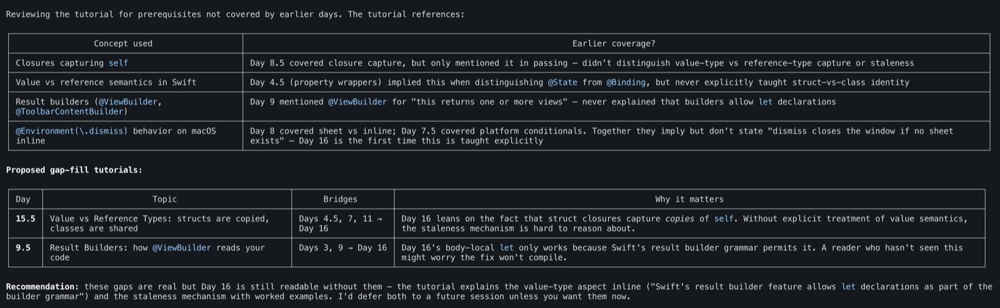

# tutorial-creator

**Generate personalized coding lessons from your own codebase.** A Claude Code skill that turns the files you actually work on every day into annotated tutorials.

Built for [Stuffolio](https://stuffolio.app), an iOS/macOS inventory management app.

<a href="https://buymeacoffee.com/stuffolio"></a>

If this skill saves you time, a [coffee](https://buymeacoffee.com/stuffolio) is appreciated. [Sponsoring](https://github.com/sponsors/Terryc21) supports further development.

---

## Why this exists

Most AI coding tools optimize for speed: generate code faster, scaffold features faster, ship faster.

But many developers are now generating code faster than they can comfortably *read* or *understand* it.

`tutorial-creator` explores a different idea: AI should help developers build fluency and understanding, not just produce more code.

While building Stuffolio, I realized something uncomfortable: Claude Code was helping me generate Swift code faster than I was developing fluency reading it. Traditional tutorials taught syntax using toy examples like `let x = 5`, but real projects don't look like that. Real projects contain async workflows, state management, dependency injection, conditional rendering, architectural patterns, edge cases, and accumulated design decisions.

I didn't want to stop building and go study disconnected tutorial exercises. I wanted to learn from the actual code appearing in my own project every day. So I built a Claude Code skill that turns real project files into personalized annotated lessons.

This skill:

- Generates personalized coding lessons from your own codebase
- Tracks vocabulary and concept progression across sessions
- Detects missing prerequisites and proposes bridge tutorials automatically
- Helps you learn naturally while continuing to ship real software

---

## tutorial-creator

### Learn to read code by reading your code

Most coding tutorials teach concepts in isolation. `tutorial-creator` teaches concepts using the actual files you already work with every day.

Instead of disconnected exercises, toy snippets, and abstract examples, you learn directly from:

- Your SwiftUI views
- Your React components
- Your Rust APIs
- Your Django models
- Your real architecture

The result is a different kind of learning: contextual, cumulative, project-aware, and immediately practical. While Claude continues helping you build, you gradually develop the fluency to review, understand, and challenge the code it generates.

### What you get

Each generated tutorial includes:

- **Vocabulary table:** only new terms, no repetitive definitions
- **Pre-test:** determine what you already know
- **Core pattern explanation:** simple conceptual overview first
- **Annotated real code:** inline explanations of your actual source file
- **Common mistakes:** realistic failure modes and fixes
- **Post-test:** apply the concepts at a deeper level
- **Answer key:** full explanations for both tests

Plus cumulative tracking across tutorials:

- `VOCABULARY.md`
- `PROGRESS.md`
- Concept progression tracking
- Learning gap analysis

### Gap analysis

After each tutorial, the skill asks: *"Does this lesson depend on concepts that haven't been taught yet?"* If so, it proposes prerequisite tutorials automatically.

This prevents the common experience of understanding Tutorial 1, surviving Tutorial 2, and getting completely lost in Tutorial 3.

A real example. I asked `tutorial-creator` to write Day 16, a tutorial about a SwiftUI captured-`self` staleness bug. After it finished, the skill checked whether the new lesson leaned on anything I hadn't covered in earlier days. It found two prerequisite gaps, ranked which ones to fill first, and named them as half-step tutorials (Day 15.5 and Day 9.5) so they would slot between existing days without renumbering anything:



I wrote both bridge tutorials in the same session. Without the gap analysis I'd have shipped Day 16 with two unstated prerequisites and slowly accumulated learning debt. With it, the curriculum stays self-consistent automatically.

### Traditional tutorials vs tutorial-creator

| Traditional tutorials | tutorial-creator |
|:--|:--|
| Toy examples | Your real codebase |
| Static curriculum | Adaptive progression |
| Generic vocabulary | Vocabulary from your project |
| No continuity | Persistent progress tracking |
| Assumes prerequisites | Detects missing concepts |
| Separate from production work | Integrated into active development |

### Example workflow

```
Your Swift file
      ↓
tutorial-creator
      ↓
Annotated lesson
      ↓
Vocabulary tracking
      ↓
Gap analysis
      ↓
Progressive fluency
```

### Usage

```
/skill tutorial-creator [topic] [source]
```

If no source file is specified, the skill searches your project for a good example of the requested topic.

### First-run setup

On first use, the skill asks:

1. Where to save tutorials
2. Your language/framework
3. Your experience level
4. Your project directory

Configuration is saved to `.claude/tutorial-config.yaml`. Edit anytime to adjust progression or preferences.

### Supported languages

Built-in learning progressions exist for:

| Language | Progression |
|:--|:--|
| **Swift / SwiftUI** | Utilities → Models → ViewModels → Views → Managers |
| **TypeScript / React** | Utilities → Hooks → Components → State Management |
| **Python / Django** | Utilities → Models → Views → Serializers |
| **Rust** | Ownership → Traits → Error Handling → Async |

Custom learning progressions can also be defined.

### Example tutorials

Two complete generated tutorials are included, showing how the skill scales from a beginner's first SwiftUI view to an advanced bug-driven case study.

**Starter:** [Day 3 -- ScoutResultsLookupView.swift](skills/tutorial-creator/examples/Day3-ScoutResultsLookupView-Annotated.md). The first SwiftUI view a Stuffolio reader walked through. They could read the file before, but reading it didn't *teach* them anything. The annotated tutorial points at what each line is doing and why, builds a vocabulary table from terms the reader hadn't formally learned (`@Environment`, `@Query`, key paths, `NavigationStack`), and ends with a pre/post-test pair so the reader knows whether the lesson actually landed.

**Advanced:** [Day 16 -- Captured-Self Staleness](skills/tutorial-creator/examples/Day16-CapturedSelfStaleness-Annotated.md). Built around a real production bug where a SwiftUI macOS app's window vanished on save. The bug was three lines and looked dumb in retrospect; the lesson is everything you'd want to know to never write it. Demonstrates the full format: vocabulary, pre-test, core pattern, annotated source, common mistakes, post-test, answer key, and connections back to earlier tutorials. This is also the tutorial whose gap analysis is shown in the screenshot above.

**Non-Swift (TypeScript / React):** [useDebouncedValue: A Custom React Hook](skills/tutorial-creator/examples/useDebouncedValue-Annotated.md). Demonstrates that the format ports cleanly to other languages. Annotates a real-world custom hook (debouncing a search input) with vocabulary, pre-test, line-by-line walkthrough, common mistakes, and a post-test calibrated to React's `useEffect` cleanup semantics and TypeScript generics. Useful as a sanity check that the skill isn't iOS-specific.

---

## Philosophy

Many AI coding tools optimize for generation, automation, and acceleration.

`tutorial-creator` focuses more heavily on:

- Comprehension
- Fluency
- Workflow understanding
- Architectural awareness
- Long-term developer growth

AI can generate code instantly. Understanding it still takes time. This skill is designed to help close that gap.

---

## Install

```bash
git clone https://github.com/Terryc21/tutorial-creator.git
```

**Global install** (all projects):

```bash
mkdir -p ~/.claude/skills && cp -r tutorial-creator/skills/* ~/.claude/skills/
```

**Project-specific install** (one project only):

```bash
mkdir -p /path/to/project/.claude/skills && cp -r tutorial-creator/skills/* /path/to/project/.claude/skills/
```

---

## Related Claude Code skills

Other skills built during development of Stuffolio:

- [**prompter**](https://github.com/Terryc21/prompter): rewrite Claude Code prompts for clarity before execution. Originally bundled with this repo; split into its own home so the audience that wants prompt rewriting can find it without first finding a tutorial-generation tool.
- [**bug-echo**](https://github.com/Terryc21/bug-echo): after fixing a bug, locate and rate similar patterns elsewhere in the codebase
- [**workflow-audit**](https://github.com/Terryc21/workflow-audit): multi-layer behavioral audit of SwiftUI user workflows
- [**radar-suite**](https://github.com/Terryc21/radar-suite): behavioral audit suite for iOS/macOS Swift projects

These tools focus on workflow behavior and user experience, not just static code inspection.

---

## History

This repo (then named `code-smarter`) originally bundled two skills: `tutorial-creator` and `prompter`. The `prompter` skill was extracted into its own repo at [github.com/Terryc21/prompter](https://github.com/Terryc21/prompter) (with full commit history preserved) so each focused tool can be discovered independently. The repo was renamed from `code-smarter` to `tutorial-creator` so the repo name matches the skill name. The old URL still redirects.

---

## Author

Created by **Terry Nyberg**, [Coffee & Code LLC](https://stuffolio.app/).

## License

Apache 2.0. See [LICENSE](LICENSE) and [NOTICE](NOTICE).
