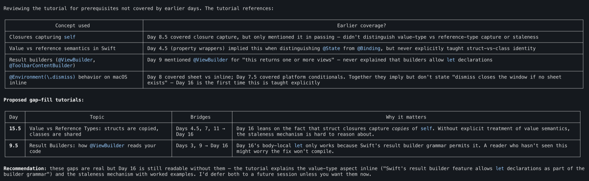

# tutorial-creator

    

**Learn from the code you're already writing.**

This turns files from your own project into lessons: what each line does, why it's
written that way, and a short quiz to check whether it stuck. It remembers what you've
learned, and notices when you're stuck.

Works with Swift, TypeScript, Python, and Rust.

*4 min read · full command reference in [USAGE.md](USAGE.md)*

---

## Try it

```bash
/plugin marketplace add Terryc21/tutorial-creator
/plugin install tutorial-creator@tutorial-creator
```

Then, in any Claude Code session:

```
/skill tutorial-creator
```

Pick **"Write a tutorial for myself"**, then **"Topic + file"**, and point it at any file
you've worked on recently. About ten minutes later you have a real lesson.

<details>
<summary><strong>Installing by hand, without the plugin system</strong></summary>

The skill sits at `skills/tutorial-creator/` inside this repo. Clone the repo somewhere,
then link that subfolder into your skills folder. Cloning the repo *straight into*
`~/.claude/skills/tutorial-creator` buries the skill one level too deep and Claude Code
won't find it.

```bash
git clone https://github.com/Terryc21/tutorial-creator ~/src/tutorial-creator && ln -s ~/src/tutorial-creator/skills/tutorial-creator ~/.claude/skills/tutorial-creator
```

For one project only, link into that project's skills folder instead:

```bash
mkdir -p /path/to/project/.claude/skills && ln -s ~/src/tutorial-creator/skills/tutorial-creator /path/to/project/.claude/skills/tutorial-creator
```

</details>

**New to Claude Code?** A *skill* is a set of written instructions Claude Code knows how
to follow. Type `/skill tutorial-creator` and it asks what you want, then does it. There
is nothing to memorise — it walks you through every choice.

---

## Why I built it

While building an iOS app with Claude Code, I noticed something uncomfortable: I was
producing Swift faster than I was learning to *read* it. The code worked. I couldn't
always have explained it.

Tutorials didn't help much. They teach with examples like `let x = 5`, and real projects
don't look like that — they're full of async work, state, and decisions somebody made
months ago for reasons nobody wrote down.

I didn't want to stop building and go do exercises. I wanted to learn from the code
already appearing in my own project every day. So I built this.

---

## What a lesson looks like

Every lesson has the same shape:

- **Words you'll need** — only the new ones
- **Quiz first** — what do you already know?
- **The idea** — the pattern in plain terms, before any code
- **Your actual code, annotated** — line by line, from your project
- **What goes wrong** — realistic mistakes and how to fix them
- **Quiz again** — same ideas, one level deeper
- **Answers** — worked explanations for both quizzes

Across lessons it also tracks your vocabulary, your scores, and which ideas you've met.

**[Read a real one →](skills/tutorial-creator/examples/Day16-CapturedSelfStaleness-Annotated.md)**
A production bug where a Mac app's window vanished on save. Three lines of code, and
obvious afterwards.

---

## It notices what you skipped



After writing a lesson, the skill asks itself: *did this lean on anything I haven't
taught yet?*

That screenshot is real. After writing lesson 16, it found two ideas the lesson assumed
but had never covered, and proposed filling them as lessons 15.5 and 9.5 — numbered to
slot in without renumbering everything else.

This is the thing that stops the familiar slide where lesson 1 makes sense, lesson 2 is
survivable, and lesson 3 is incomprehensible. The gap was never in lesson 3.

---

## It quizzes you, and you can't grade yourself

The skill keeps the words you've met and how well you know each one: **new**,
**reviewing**, **mastered**, or **confused**.

**You don't set those. You earn them.** Three correct answers in a row to reach mastered;
two misses out of three drops you to confused. `vocab gap` shows what you keep getting
wrong, and can build your next lesson around it.

The one exception: you can move something from mastered back to reviewing when you
notice you've forgotten it. Getting back means earning it again.

> Judging your own understanding is the thing people are worst at. A word you *feel*
> solid on and one you can *define from memory* are not the same, and only the second can
> be measured.

Want your own pace instead? Export the same vocabulary as flashcards — an Anki deck, cards
you can print and cut out, or plain text — and study however you like.

---

## What it can do

| | |
|---|---|
| **Write a lesson** | Six places to start — see [USAGE.md](USAGE.md) |
| **Handle your vocabulary** | Add, quiz, merge, and see your gaps |
| **Pull vocabulary from anywhere** | Point it at a URL, a file, or this conversation and it drafts a definition and a real example for every term worth keeping |
| **Turn vocabulary into flashcards** | Export as an Anki deck, print-ready cards, or plain text — filterable by where a term came from and when |
| **Show your progress** | A read-only summary of where you are |

Plus a second path for **writing to teach** rather than to learn: turn what you've
learned into a Reddit post, a blog post, a book chapter, or reference documentation, each
with its own voice.

**[Full command reference →](USAGE.md)**

---

## Examples

Real generated output, checked in — not illustrations written by hand.

- **[The opening screen](skills/tutorial-creator/examples/01-Intro-screen-after-invoking-tutorial-creator-at-end-of-a-session.md)** — what you see when you start. Everything below is what it produced.
- **[Lesson 3 — a first SwiftUI view](skills/tutorial-creator/examples/Day03-ScoutResultsLookupView-Annotated.md)** — early days. A reader could read this file already; reading it hadn't taught them anything.
- **[Lesson 16 — a stale captured value](skills/tutorial-creator/examples/Day16-CapturedSelfStaleness-Annotated.md)** — later. A real bug, and everything you'd need to never write it.
- **[A React hook](skills/tutorial-creator/examples/useDebouncedValue-Annotated.md)** — the same shape in TypeScript, showing this isn't Swift-only.
- **[Lesson 22 — verifying the whole path](skills/tutorial-creator/examples/Day22-VerifyingTheWholePath-Annotated.md)** — built from two failures instead of a file, with a *passing test suite* as the annotated source.

---

## How solid is this?

**v2.0.1.** The version 1 line ran through six months of daily use on a real Swift app
before the version 2 rewrite.

**Best supported:** Swift and SwiftUI. Deepest coverage, and every bundled example.

**Works, less proven:** TypeScript, Python, and Rust have working teaching sequences, but
every example you can read here is Swift. The publishing styles have been tuned but
haven't seen much use beyond my own writing.

**What would help most:** someone using `vocab review` on a non-Swift project for a few
weeks. Does memory-testing work as well for Python decorators as it does for SwiftUI
property wrappers? I don't know yet. [Tell me](https://github.com/Terryc21/tutorial-creator/issues) if you try it.

---

## Questions and problems

| Where | For |
|:--|:--|
| [**Discussions**](https://github.com/Terryc21/tutorial-creator/discussions) | Ideas, questions, "is it meant to do that?", how you're using it. The right place for "I'm not sure this is a bug." |
| [**Issues**](https://github.com/Terryc21/tutorial-creator/issues) | Something's broken: it crashed, the output was wrong, the install steps didn't work. |

Pull requests welcome. For anything substantial, open a Discussion first.

---

## Related skills

[**bug-echo**](https://github.com/Terryc21/bug-echo) — find the same bug elsewhere after a fix ·
[**bug-prospector**](https://github.com/Terryc21/bug-prospector) — hunt for bugs before a release ·
[**workflow-audit**](https://github.com/Terryc21/workflow-audit) — trace SwiftUI behaviour ·
[**unforget**](https://github.com/Terryc21/unforget) — a one-file list of deferred work ·
[**radar-suite**](https://github.com/Terryc21/radar-suite) — six skills tracing user paths ·
[**prompter**](https://github.com/Terryc21/prompter) — rewrite prompts before running them ·
[**skill-reviewer**](https://github.com/Terryc21/skill-reviewer) — candid reviews of other skills

---

## Also

- **[USAGE.md](USAGE.md)** — every command and setting
- **[CHANGELOG.md](CHANGELOG.md)** — what changed, and the 1.1 → 2.0 notes
- **History** — this repo was once `code-smarter` and held two skills. `prompter` moved to
  [its own repo](https://github.com/Terryc21/prompter), and the repo was renamed to match
  the skill. Old links still redirect.

**Terry Nyberg**, [Coffee & Code LLC](https://stuffolio.app/). If this helped you get
fluent on a real codebase, [a coffee](https://buymeacoffee.com/stuffolio) is appreciated —
though a note about how it went on a non-Swift project is worth more.

[](https://www.buymeacoffee.com/stuffolio)

Apache 2.0 — see [LICENSE](LICENSE) and [NOTICE](NOTICE).
